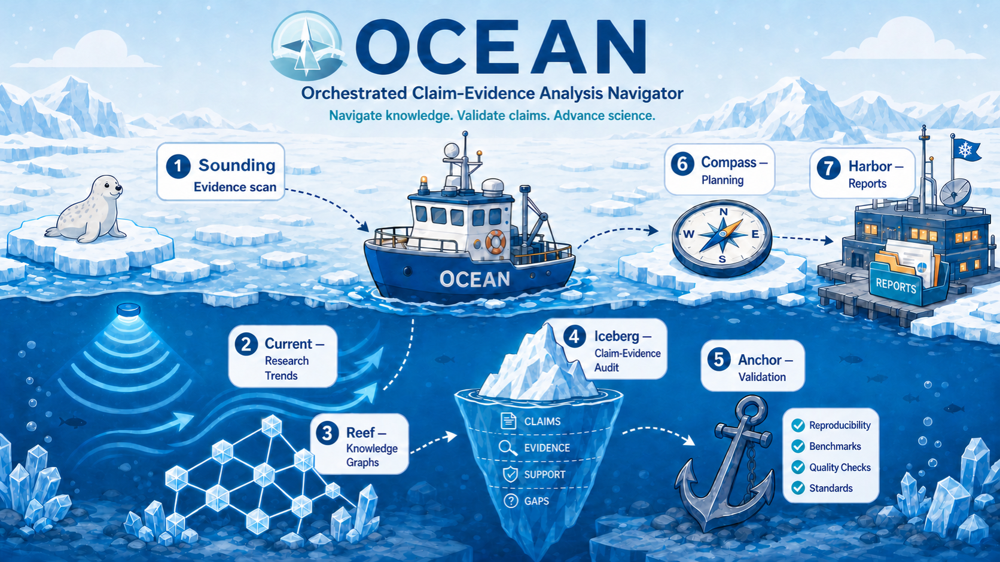

# OCEAN: Orchestrated Claim-Evidence Analysis Navigator

[中文版本](README.zh-CN.md)



OCEAN is a lightweight Codex-compatible skill for biomedical claim-evidence navigation across medical and biological research. It can support biomedical AI studies, biological AI studies, manuscripts, databases, knowledge graphs, clinical prediction work, journal positioning, validation planning, and collaboration boundary analysis. A Domain Lens and Data/Tool Router apply evidence standards suited to medical, biological, omics, clinical, drug, KG/database, proposal, and collaboration tasks.

Its evidence-discovery module is named **Sounding**: a source-packet workflow for scanning literature, evidence boundaries, and traceable review materials.

**Simple at the surface, rigorous underneath, and traceable when the work becomes a project.**

[Detailed usage guide](docs/usage-guide.md) | [中文使用指南](docs/usage-guide.zh-CN.md)

## What this is

This repository is designed for researchers and teams who want an installable,
evidence-bound biomedical workflow inside Codex.

It provides two entry points:

1. `AGENTS.md` at the repository root, so Codex can automatically read project-level instructions.
2. `skills/ocean/SKILL.md`, so the same workflow can be used as a portable skill folder if your Codex interface supports Skills.

## Boundary, scope, and non-goals

OCEAN is a **source-packet-based claim-evidence workflow**. Its main objects are source packets, evidence gates, claim audit cards, safe rewrites, negative space, reviewer-risk tickets, and validation plans.

OCEAN is **biomedical first, AI-aware, and evidence-boundary centered**.

- Core scope: biomedical research.
- Main domains: medical research and biological research.
- Priority use cases today: medical AI research, biological AI research, bioinformatics, clinical prediction, knowledge graphs, databases, public review signals, manuscripts, and research planning.
- Out of scope: summary-only paper reading, unsupported clinical advice, invented data, or broad general-science claims without a biomedical evidence question.

OCEAN is not:

- an autonomous AI scientist;
- a substitute for experiments, domain experts, or clinical judgment;
- a source of invented evidence or unsupported clinical advice.

## Use OCEAN in 60 seconds

Users choose the outcome they need; OCEAN chooses the minimum required modules.

| Mode | Ask OCEAN to | Default visible result |
|---|---|---|
| **Explore** | understand a paper, idea, source, or field | clear explanation plus evidence limits |
| **Design** | turn an idea, proposal, or gap into a feasible study | research route, decisive controls, next experiment |
| **Audit** | test claims, methods, validation, or submission readiness | claim verdicts, risks, missing evidence, fixes |
| **Revise** | improve finished manuscript text | clean replacement text; notes kept separate |
| **Track** | preserve concise project or submission status | Status, Progress, Next, Public Boundary |

```text
Use $ocean to explore this DOI for a journal club.
Use $ocean in Design mode to turn this one-sentence idea into a feasible study.
Use $ocean in Audit mode to check this manuscript's claims and validation.
Use $ocean in Revise mode and return clean replacement text first.
Use $ocean in Track mode to record this confirmed submission update.
```

You do not need to know the seven module names. See the
[detailed English guide](docs/usage-guide.md) or
[Chinese guide](docs/usage-guide.zh-CN.md) for installation, prompt templates,
output depth, source handling, tools, and GitHub safety.

## Manuscript lifecycle modes

OCEAN now separates manuscript work by lifecycle instead of treating every manuscript request as a full audit:

| Mode | Use it for | Default output |
|---|---|---|
| **Design / Audit** | ideas, proposals, experiment design, early drafts, or explicit weakness finding | Relevant module artifacts; full-chain critique only when genuinely needed |
| **Manuscript Revision** | finished passages that need polishing, shortening, translation, or evidence-safe wording changes | Clean replacement text first; editorial notes and author queries remain separate |
| **Pre-submission Stress Test** | explicit reviewer simulation or full submission-readiness audit | Audit report plus separately isolated safe rewrites |
| **Reviewer Response** | reviewer/editor comments and manuscript revision | Separate response-letter text, revised manuscript text, and author-only notes |

A generic request to revise a finished paragraph defaults to **Manuscript Revision**. OCEAN may use Iceberg as a silent safety check, but module labels, reviewer criticism, deletion commands, risk tables, scores, and new placeholders must not appear in paste-ready manuscript prose. See [`skills/ocean/references/manuscript-revision-mode.md`](skills/ocean/references/manuscript-revision-mode.md).

## Real project progress

OCEAN is also tracked in real manuscript and research workflows through the concise [`projects/`](projects/README.md) progress hub. Each page shows only current status, recent progress, the next step, and the public boundary. Raw analyses, private manuscripts, and internal working records stay outside the public repository.

Current records cover the [whole-wheat fermented broth study](projects/whole-wheat-fermented-broth/README.md) and [Delirium AI ICU prediction transportability](projects/delirium-ai/README.md). Project tracking does not prove scientific validity, submission, acceptance, or clinical readiness.

## Project-start records

When a new OCEAN analysis becomes a traceable research project, Harbor can create a public-safe Project Start Card and GitHub Sync Ticket. This is meant to keep important research work from staying only in chat history. It does not publish raw data, private manuscripts, patient-level data, confidential review text, API keys, or unconfirmed submission outcomes.

The project-start gate is documented in `skills/ocean/references/project-start-gate.md`. A local record can be generated with:

```bash
python3 skills/ocean/scripts/create_project_start_record.py \
  --title "Example biomedical project" \
  --domain "Biological research" \
  --public-safe unclear \
  --outdir outputs/project-records \
  --remote-push "needs approval"
```

## Module flow

OCEAN selects only the modules needed for the request and hides module names by default. For end-to-end work, each module completes a distinct event and hands off a concrete artifact. See `docs/module-map.md` for the fuller map.

| Order | Module | Event it completes | Typical output |
|---:|---|---|---|
| 1 | **Sounding** | Evidence discovery and source-boundary setup | Source packet, Evidence Radar Map, Negative Space, Handoff Ticket |
| 2 | **Current** | Field trend and direction-flow reading | Trend map, recent movement, opportunity/risk notes |
| 3 | **Reef** | Biomedical resource, clinical data, KG, and database organization | Resource provenance map, data-source routing, database/KG evidence table |
| 4 | **Iceberg** | Claim-evidence audit under the surface claim | Claim-evidence matrix, downgrade/rewrite notes |
| 5 | **Anchor** | Validation, replication, leakage, benchmark, and reproducibility planning | Validation checklist, benchmark/leakage plan, reproducibility risks |
| 6 | **Compass** | Research planning and strategic decision-making | Idea card, experiment plan, journal/collaboration strategy |
| 7 | **Harbor** | Report preservation and collaboration boundary memory | Final report, decision note, contribution boundary record |

## Quick start

### Install From GitHub

Install the skill from this repository:

```bash
python3 ~/.codex/skills/.system/skill-installer/scripts/install-skill-from-github.py \
  --repo nslbotnslbot/ocean-skill \
  --path skills/ocean \
  --ref main
```

Then restart Codex or open a new Codex session and test recognition:

```text
Use $ocean to explore this abstract-only claim.
Give me the short Decision Card and state what cannot yet be concluded.
```

If you only wanted a temporary test install, remove it after testing:

```bash
rm -rf ~/.codex/skills/ocean
```

### Local Copy

If you already cloned this repository, copy the skill folder into your Codex skills directory:

```bash
cp -R skills/ocean ~/.codex/skills/
```

Then ask Codex:

```text
Use $ocean in Audit mode to evaluate the uploaded manuscript.
Please output in Chinese.
Focus on scientific value, reliability, key risks, missing validation, collaboration contribution boundary, and journal positioning.
Use Standard output because this is an explicit multi-part audit.
```

For wording-only revision of an already drafted passage:

```text
Use $ocean in Manuscript Revision mode. Return clean replacement text first.
Keep audit notes and author queries outside the manuscript text.
```

For an empty review report skeleton:

```bash
python3 skills/ocean/scripts/make_review_skeleton.py \
  --title "My AI for Science Project" \
  --project-type "AI-agent system / biomedical evidence audit" \
  --out outputs/review_skeleton.md
```

For a claim table template:

```bash
python3 skills/ocean/scripts/make_claim_table.py \
  --out outputs/claim_table.csv
```

After filling the CSV, validate and summarize it:

```bash
python3 skills/ocean/scripts/check_claim_table.py \
  outputs/claim_table.csv \
  --out outputs/claim_table_summary.md
```

To find and safely check a covered bioinformatics tool:

```bash
python3 skills/ocean/scripts/tools/bioinformatics_tool_router.py list-tools
python3 skills/ocean/scripts/tools/bioinformatics_tool_router.py profile --tool last
python3 skills/ocean/scripts/tools/bioinformatics_tool_router.py \
  check --tool last --output outputs/last-check.json
```

See the [bilingual tool index](skills/ocean/scripts/README.md) for database
adapters, workflow templates, execution layers, and evidence boundaries.

## Output principle

Default output language: Chinese.

For ordinary first-turn and narrow questions, OCEAN begins with a short Decision Card: conclusion, basis, what cannot currently be judged, the main risk, and the next action. Standard and Deep audits are used only when explicitly requested or genuinely needed. Manuscript Revision returns clean replacement prose first. Track uses only Status, Progress, Next, and Public Boundary.

Every mode remains evidence-bound. Do not overstate novelty or validity. Always distinguish:

- hypothesis vs evidence
- association vs causality
- database co-occurrence vs mechanism
- internal validation vs external validation
- system demonstration vs scientific discovery
- light advice vs authorship-level contribution

For explicit audits, OCEAN can use the full claim-evidence contract. Scores, journal positioning, authorship analysis, and seven-module narratives are omitted unless requested or materially useful.

## Repository layout

```text
skills/ocean/  installable skill, references, adapters, and tool wrappers
tests/         small deterministic CI checks and fixtures
docs/          public architecture and usage guides
projects/      public-safe progress records for real OCEAN research projects
examples/      small source-safe examples
assets/        logos and README media
outputs/       ignored local generated work
.github/       continuous integration
```

See [`docs/repository-layout.md`](docs/repository-layout.md) for the concise ownership map. Generated reports, model outputs, scorecards, local availability probes, and experimental logs belong in ignored `outputs/`, not in GitHub.

## Quality checks

The public repository keeps only deterministic checks required to protect the installable skill:

```bash
python3 -m pip install -r requirements-dev.txt
python3 tests/check_json_files.py
python3 tests/validate_skill.py
python3 tests/check_project_records.py
python3 -m unittest discover -s tests -p 'test_*.py' -v
python3 skills/ocean/scripts/check_ocean_contracts.py --out outputs/ocean-contract-check.md
python3 skills/ocean/scripts/check_manuscript_revision_mode.py --out outputs/manuscript-revision-check.md
```

These checks protect package structure, project-record boundaries, tool-index coverage, manuscript channel isolation, and core OCEAN contracts. They are regression tests, not scientific-performance claims or a model leaderboard.

## License

MIT License. See `LICENSE`.
