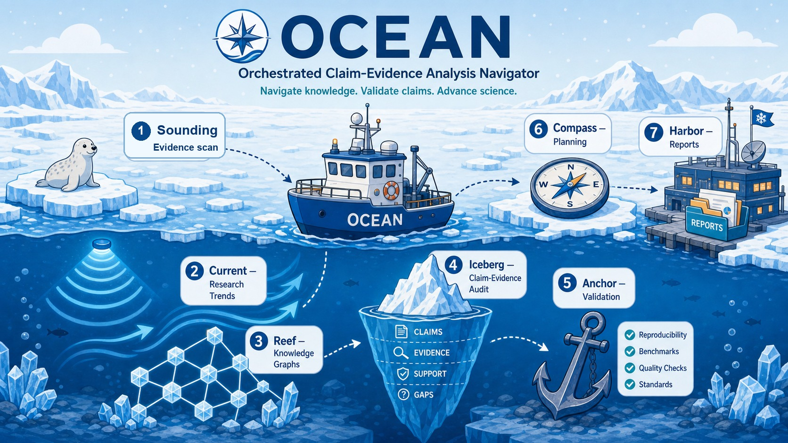

# OCEAN: Orchestrated Claim-Evidence Analysis Navigator

[English README](README.md)



OCEAN 是一个轻量级、兼容 Codex 的外部审计层和 skill，用于医学研究与生物学研究中的 claim-evidence 导航和 research design workflow。它关注 biomedical research，理解 AI 研究场景，但不只服务于 AI 论文：也可以支持生物医学 AI、生物学 AI、manuscript、数据库、知识图谱、临床预测、验证规划、期刊定位和协作边界分析。现在它加入了一个中心化的 Domain Lens 和 Data/Tool Router，让 medical、biological、omics、clinical、drug、KG/database、proposal 和 collaboration 任务走不同证据标准，而不是套用同一个泛用 checklist。

OCEAN 是一个独立的开源工作流项目。它的证据发现模块命名为 **Sounding**：这是一个 source-packet 工作流，用于扫描文献、证据边界和可追踪的 review 材料。OCEAN 审计的是已有来源能支持什么、不能支持什么；它不管理某个研究项目的内部执行或发布流程。

## 这是什么

这个 package 设计用于在 Codex 中个人使用，也可以作为一个小型 GitHub 仓库发布。

它提供两个入口：

1. 仓库根目录的 `AGENTS.md`，让 Codex 自动读取项目级指令。
2. `skills/ocean/SKILL.md`，如果你的 Codex 界面支持 Skills，同一个工作流也可以作为可移植的 skill 文件夹使用。

## 边界、范围和非目标

OCEAN 应该被描述为一个 **基于 source packet 的 claim-evidence 外部审计层**。它的核心对象是 source packet、evidence gate、claim audit card、safe rewrite、negative space、reviewer-risk ticket 和 validation plan。

更完整的公开定位说明见 [`docs/project-boundary.md`](docs/project-boundary.md)。

OCEAN 的定位是：**biomedical first, AI-aware, evidence-boundary centered**。

- 核心范围：生物医学研究。
- 两个主要方向：医学研究和生物学研究。
- 当前优先场景：medical AI research、biological AI research、生物信息学、临床预测、知识图谱、数据库、public review 信号、manuscript 和研究规划。
- 不适合：只做普通论文总结、无证据的临床建议、虚构数据，或没有生物医学证据问题的泛科学讨论。

OCEAN 不是：

- autonomous AI scientist；
- 执行实验或生成发现的系统；
- 内部 evidence ledger 或项目发布工作流；
- human-supervised execution-package-to-release-gate 系统；
- 面向单一研究项目的 discovery endpoint spectrum。

公开介绍 OCEAN 时，优先使用 **external claim-evidence auditing**、**evidence-type gating**、**source-packet construction**、**safe claim rewriting** 和 **public adversarial case matrices**。不要把 evidence ledger、paired non-claim、endpoint ladder 或 release gate 写成中心贡献。

## 适用场景

当你让 Codex 审查以下内容时，可以使用 OCEAN：

- manuscript
- preprint
- system paper
- AI-agent / AI-for-Science 项目
- 生物医学 AI 研究
- 生物信息学研究
- database / knowledge graph / CTD 风格的证据系统
- 临床预测模型
- 合作贡献边界
- 论文定位与期刊策略
- reviewer 风格批判和投稿前压力测试

## 真实流程追踪

OCEAN 也开始用于真实论文和投稿流程。公开安全版的应用案例和投稿状态追踪见 `docs/application-submission-tracker.md`。

## 模块流程

OCEAN 按顺序使用七个模块；这是一个外部审计序列，不是实验执行循环。每个模块应该完成不同的事件，并把一个具体产物交给下一步。更完整的公开说明见 `docs/module-map.md`。

| 顺序 | Module | 完成的事件 | 典型产物 | 当前验证状态 |
|---:|---|---|---|---|
| 1 | **Sounding** | 证据发现和 source boundary 建立 | Source packet、Evidence Radar Map、Negative Space、Handoff Ticket | 已完成 strict multi-model eval |
| 2 | **Current** | 领域趋势和方向流动分析 | Trend map、近期流动、机会/风险说明 | M1 已覆盖；M2 已筛查 |
| 3 | **Reef** | 生物医学资源、临床数据、KG、数据库证据组织 | Resource provenance map、data-source routing、database/KG evidence table | M1 已覆盖；M2 已筛查 |
| 4 | **Iceberg** | 审核表面 claim 下面的证据支撑 | Claim-evidence matrix、降级/改写建议 | M1 已覆盖；M2 已筛查 |
| 5 | **Anchor** | 验证、复现、leakage、benchmark、reproducibility 规划 | Validation checklist、benchmark/leakage plan、复现风险 | M1 已覆盖；M2 已筛查 |
| 6 | **Compass** | 研究计划和策略决策 | Idea card、实验计划、期刊/合作策略 | M1 已覆盖；M2 已筛查 |
| 7 | **Harbor** | 审计报告沉淀和协作边界记忆 | Final audit report、decision note、贡献边界记录 | M1 已覆盖；M2 已筛查 |

## 快速开始

### 从 GitHub 安装

从这个仓库安装 skill：

```bash
python3 ~/.codex/skills/.system/skill-installer/scripts/install-skill-from-github.py \
  --repo nslbotnslbot/ocean-skill \
  --path skills/ocean \
  --ref main
```

然后重启 Codex，或打开新的 Codex session，并测试识别：

```text
Use $ocean to audit this abstract-only claim.
State inspected / not inspected / cannot conclude / needed next.
```

如果只是临时测试安装，测试后可以删除：

```bash
rm -rf ~/.codex/skills/ocean
```

### 本地复制

如果你已经 clone 了这个仓库，可以把 skill 文件夹复制到 Codex skills 目录：

```bash
cp -R skills/ocean ~/.codex/skills/
```

然后向 Codex 提问：

```text
Use $ocean to evaluate the uploaded manuscript.
Please output in Chinese.
Focus on scientific value, reliability, key risks, missing validation, collaboration contribution boundary, and journal positioning.
Use the standard OCEAN output format unless I ask for a quick or deep report.
```

生成空的 review report skeleton：

```bash
python3 skills/ocean/scripts/make_review_skeleton.py \
  --title "My AI for Science Project" \
  --project-type "AI-agent system / biomedical evidence audit" \
  --out outputs/review_skeleton.md
```

生成 claim table 模板：

```bash
python3 skills/ocean/scripts/make_claim_table.py \
  --out outputs/claim_table.csv
```

填写 CSV 后，验证并总结：

```bash
python3 skills/ocean/scripts/check_claim_table.py \
  outputs/claim_table.csv \
  --out outputs/claim_table_summary.md
```

## 输出原则

默认输出语言：中文。

分析必须直接、批判，并且受证据边界约束。不要夸大 novelty 或 validity。始终区分：

- hypothesis vs evidence
- association vs causality
- database co-occurrence vs mechanism
- internal validation vs external validation
- system demonstration vs scientific discovery
- light advice vs authorship-level contribution

默认情况下，OCEAN 使用固定 output contract：audit card、evidence boundary、claim-evidence matrix、risk register、missing evidence/analysis、collaboration boundary、journal positioning、next actions 和 scores。只有在窄问题中使用 quick mode；完整 manuscript 或 reviewer-style report 使用 deep mode。

## 仓库结构

```text
.env.ocean.example
README.zh-CN.md
assets/
└── ocean-polar-workflow.jpg
docs/
├── project-boundary.md
├── application-submission-tracker.md
├── module-map.md
└── evaluation/
    ├── README.md
    ├── round-1-5-results.md
    ├── sounding-adversarial-case-library.md
    └── reference-materials/
        ├── boundary-cases.md
        └── public-sources.md
skills/ocean/
├── SKILL.md
├── agents/openai.yaml
├── evals/
│   ├── anti-hallucination-cases.md
│   ├── collaborative-workflow-r1-results.md
│   ├── contamination-resistance-round5.md
│   ├── full-ocean-workflow-cases.md
│   ├── full-ocean-workflow-protocol.md
│   ├── ocean-module-m1-results.md
│   ├── ocean-module-m2-results.md
│   ├── ocean-module-m2-needs-review-triage.md
│   ├── forward-test-cases.md
│   ├── public-source-protocol.md
│   ├── real-article-adversarial-cases.md
│   ├── reef-strict-eval-r1-cases.json
│   ├── reef-strict-eval-r1-coverage.json
│   ├── reef-strict-eval-r1-results.md
│   ├── domain-router-big-experiment-r1-cases.json
│   ├── domain-router-model-r1-cases.json
│   ├── domain-router-model-r1-results.md
│   ├── release-validation-log.md
│   ├── sounding-multimodel-cases.json
│   ├── sounding-multimodel-models.example.json
│   ├── sounding-multimodel-r1-codex-slice-results.md
│   ├── sounding-multimodel-strict-eval.md
│   └── source-candidates.md
├── references/
│   ├── audit-lenses.md
│   ├── anchor.md
│   ├── claim-evidence-table.md
│   ├── compass.md
│   ├── current.md
│   ├── data-tool-router.md
│   ├── domain-lens.md
│   ├── harbor.md
│   ├── iceberg.md
│   ├── module-handoff.md
│   ├── module-artifact-contract.md
│   ├── output-contract.md
│   ├── reef-biological-data-sources.md
│   ├── reef.md
│   ├── reef-api-adapters.md
│   ├── research-design-workflow.md
│   ├── reviewer-lens.md
│   ├── review-report.md
│   └── sounding.md
└── scripts/
    ├── make_claim_table.py
    ├── check_claim_table.py
    ├── make_review_skeleton.py
    ├── check_ocean_contracts.py
    ├── run_reef_api_adapter.py
    └── run_sounding_multimodel_eval.py
```

## 评估总结

面向公开发布的 validation notes 位于 `docs/evaluation/`。简洁总结在 `docs/evaluation/round-1-5-results.md`，公开来源标识符在 `docs/evaluation/reference-materials/public-sources.md`。

目前最深入的 module-specific strict testing 仍然集中在 **Sounding**。R2 和 R3 测试的是 Sounding source-packet workflow，模型包括 Qwen、DeepSeek、Kimi、MiniMax、Gemini、Claude，以及一个 Perplexity retrieval control group。M1 增加了七个 module 的全覆盖测试，M2 对 98 个 M1 输出做了第一轮 heuristic scoring。Perplexity 被作为 retrieval-oriented control 处理，因为它的产品定位强调 answer/search grounding；它不是 OCEAN 的依赖。

Reef 现在包含 biological/clinical data-source routing catalog，覆盖基因、蛋白、变异、omics repository、cell atlas、cancer genomics portal、drug resource、clinical registry、regulatory/safety data、EHR/cohort resource、imaging/signal dataset、model organism 和 microbiome/pathogen resource。Reef-R1 增加了第一轮专门的 Reef strict eval，重点测试 resource provenance、API/database 证据边界、KG association overclaim、cell atlas planning boundary 和 clinical registry metadata boundary。

Bioinformatics Real-Tool Smoke R1 检查 115 个 scaffolded bioinformatics tools 在当前本地执行环境中是否真的可调用。这轮本地运行中，3 个工具/adapter 达到 smoke 级执行，112 个在当前 PATH、Python 或 R 环境中不可用。这个结果是 availability check，不是 end-to-end biological analysis。

每个 bioinformatics tool 文件夹现在也包含一个 science-skills 风格的 `references/tool_usage.md` guide。它们写清 use/avoid rules、真实本地运行前必须检查的证据、stop conditions 和 OCEAN handoff 路径，但不声称外部工具已经安装。

Reef 现在也有可执行的 API/database adapters，覆盖 UniProt、PubMed、EuropePMC、ChEMBL、OpenTargets、STRING、Reactome、QuickGO、ClinVar、gnomAD 和 AlphaFold DB。这些 wrapper 可以 dry-run，也可以用 `--execute` 做 bounded live public API request，并输出带明确证据边界的 OCEAN packet。

Collaborative Workflow R1 增加了跨 module workflow stress test，覆盖 proposal、trend、resource/API、claim downgrade、validation、reviewer-pressure-to-idea、benchmark fairness 和 Harbor handoff cases。

仓库也包含 full-workflow protocol 和 case seeds，用于测试一篇论文、一个 idea、一段 proposal、一条 review comment 或一个 resource/KG seed 是否能通过七个 OCEAN module，并保持稳定的 handoff 和 evidence boundary。

Seven-Module Coordination R1 增加了第一轮确定性全链路结构检查，覆盖 paper source packet、proposal 和 one-sentence idea 三类输入，测试 artifact coverage、handoff continuity、claim downgrade gate 和 Harbor closure。

Research Design Workflow R1 测试 OCEAN 是否能把不确定的 idea、proposal、resource request、reviewer pressure 和 workflow decision 转成 design gates、validation gates、research routes 和 Harbor decision memory，同时不声称未经验证的成熟度。第一轮计分覆盖 6 条完成模型线、42 个 usable outputs；一条 Kimi lane 因 runtime blocked 单独记录。

Domain Router Big Experiment R1 离线测试新的中心路由层。它检查 Domain Lens、Data/Tool Router 和 Module Artifact Contract 是否已经接入 skill 入口，并覆盖 medical AI、biological AI、omics、clinical research、drug/target hypothesis、KG/database resource、public-review pressure、collaboration boundary 和 stale Harbor reuse 等代表性生物医学输入。

Domain Router Model R1 进一步用 Qwen、DeepSeek、Kimi fallback、MiniMax-M1、Gemini、Claude 和 Perplexity retrieval control 测试同一个中心层。该轮完成 49/49 usable outputs，M3 均分 17.86/20。最重要的 flagged issue 是 Reef/Open Targets case 中出现 endpoint invention trap，目前记录为 data-router 安全问题。

更早的 anti-hallucination 和 contamination-resistance 测试覆盖了 OCEAN 的 evidence-boundary 行为和 claim downgrade 纪律。M1/M2 仍然应被理解为 coverage + heuristic screening，而不是最终科学正确性验证或模型排行榜。

这些文件说明测试了什么、哪些通过了，同时不会复制 private materials、长篇论文段落或 hidden-answer logs。公开 evaluation materials 被设计为可复用的 source-boundary checks，不是内部研究轨迹记录，也不是 discovery claim。内部 release log 保留在 `skills/ocean/evals/release-validation-log.md`。

## 开发检查

发布前运行示例脚本：

```bash
python3 skills/ocean/scripts/make_claim_table.py --out outputs/claim_table.csv
python3 skills/ocean/scripts/check_claim_table.py examples/sample_claim_table.csv --out outputs/claim_table_summary.md
python3 skills/ocean/scripts/make_claim_table.py --empty --out outputs/empty_claim_table.csv
python3 skills/ocean/scripts/check_claim_table.py outputs/empty_claim_table.csv --out outputs/empty_claim_table_summary.md
python3 skills/ocean/scripts/run_reef_api_adapter.py --adapter ncbi-eutils --database pubmed --query "BRCA1 breast cancer" --retmax 5 --out outputs/reef_api_packet.json
python3 skills/ocean/scripts/run_sounding_multimodel_eval.py --dry-run
python3 skills/ocean/scripts/check_ocean_contracts.py
```

发布前，请使用真实用户提供的、或公开且 source-traceable 的材料，运行 `skills/ocean/evals/forward-test-cases.md` 中的 manual forward tests。使用 `skills/ocean/evals/anti-hallucination-cases.md` 测试 incomplete、missing、contradictory 或 non-traceable evidence。使用 `skills/ocean/evals/public-source-protocol.md` 选择 DOI papers、bioRxiv/medRxiv preprints 和 public peer review reports；在 `skills/ocean/evals/source-candidates.md` 中追踪具体候选；使用 `skills/ocean/evals/sounding-multimodel-strict-eval.md` 进行 model-robustness checks；使用 `skills/ocean/evals/full-ocean-workflow-protocol.md` 进行七模块 workflow 检查；并在 `skills/ocean/evals/release-validation-log.md` 中总结 validation-check outcomes。

## License

MIT License。见 `LICENSE`。
