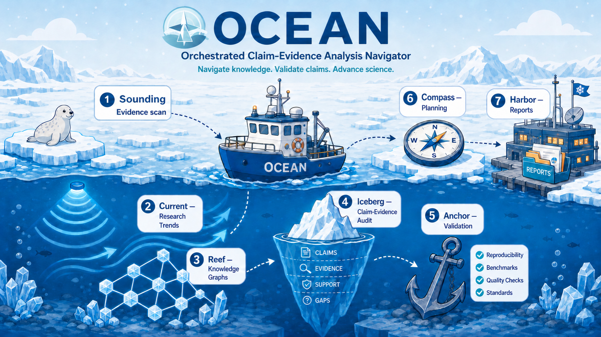

# OCEAN: Orchestrated Claim-Evidence Analysis Navigator

[English README](README.md)



OCEAN 是一个轻量级、兼容 Codex 的外部审计层和 skill，用于医学研究与生物学研究中的 claim-evidence 导航和 research design workflow。它关注 biomedical research，理解 AI 研究场景，但不只服务于 AI 论文：也可以支持生物医学 AI、生物学 AI、manuscript、数据库、知识图谱、临床预测、验证规划、期刊定位和协作边界分析。现在它加入了一个中心化的 Domain Lens 和 Data/Tool Router，让 medical、biological、omics、clinical、drug、KG/database、proposal 和 collaboration 任务走不同证据标准，而不是套用同一个泛用 checklist。

OCEAN 是一个独立的开源工作流项目。它的证据发现模块命名为 **Sounding**：这是一个 source-packet 工作流，用于扫描文献、证据边界和可追踪的 review 材料。OCEAN 审计的是已有来源能支持什么、不能支持什么；它不管理某个研究项目的内部执行或发布流程。

## 这是什么

这个 package 设计用于在 Codex 中个人使用，也可以作为一个小型 GitHub 仓库发布。

它提供两个入口：

1. 仓库根目录的 `AGENTS.md`，让 Codex 自动读取项目级指令。
2. `skills/ocean/SKILL.md`，如果你的 Codex 界面支持 Skills，同一个工作流也可以作为可移植的 skill 文件夹使用。

## 边界、范围和非目标

OCEAN 应该被描述为一个 **基于 source packet 的 claim-evidence 外部审计层**。它的核心对象是 source packet、evidence gate、claim audit card、safe rewrite、negative space、reviewer-risk ticket 和 validation plan。

更完整的公开定位说明见 [`docs/project-boundary.md`](docs/project-boundary.md)。

OCEAN 的定位是：**biomedical first, AI-aware, evidence-boundary centered**。

- 核心范围：生物医学研究。
- 两个主要方向：医学研究和生物学研究。
- 当前优先场景：medical AI research、biological AI research、生物信息学、临床预测、知识图谱、数据库、public review 信号、manuscript 和研究规划。
- 不适合：只做普通论文总结、无证据的临床建议、虚构数据，或没有生物医学证据问题的泛科学讨论。

OCEAN 不是：

- autonomous AI scientist；
- 执行实验或生成发现的系统；
- 内部 evidence ledger 或项目发布工作流；
- human-supervised execution-package-to-release-gate 系统；
- 面向单一研究项目的 discovery endpoint spectrum。

公开介绍 OCEAN 时，优先使用 **external claim-evidence auditing**、**evidence-type gating**、**source-packet construction**、**safe claim rewriting** 和 **public adversarial case matrices**。不要把 evidence ledger、paired non-claim、endpoint ladder 或 release gate 写成中心贡献。

## 适用场景

当你让 Codex 审查以下内容时，可以使用 OCEAN：

- manuscript
- preprint
- system paper
- AI-agent / AI-for-Science 项目
- 生物医学 AI 研究
- 生物信息学研究
- database / knowledge graph / CTD 风格的证据系统
- 临床预测模型
- 合作贡献边界
- 论文定位与期刊策略
- reviewer 风格批判和投稿前压力测试

## 稿件生命周期模式

OCEAN 现在会先判断稿件处于什么阶段，不再把每一次 manuscript 请求都当成全模块审计：

| 模式 | 适用场景 | 默认输出 |
|---|---|---|
| **Design / Audit** | idea、proposal、实验设计、早期草稿，或明确要求找问题 | 使用必要模块；只有真正的端到端任务才运行全链批判 |
| **Manuscript Revision** | 已经写完的段落需要润色、精简、翻译或证据安全的措辞修改 | 先给可直接替换的干净正文；修改说明和作者确认项分开 |
| **Pre-submission Stress Test** | 明确要求模拟审稿人或做完整投稿前审计 | 审计报告和 safe rewrite 分离输出 |
| **Reviewer Response** | 处理审稿人/编辑意见并修改正文 | 逐条回复、修订正文、作者内部说明三个通道分开 |

对已经写完的段落，如果用户只是说“修改一下”或“润色”，默认进入 **Manuscript Revision**。OCEAN 可以在后台用 Iceberg 做安全检查，但 module 标签、审稿式批判、删除命令、风险表、评分和新建占位符都不能进入可粘贴正文。完整规则见 [`skills/ocean/references/manuscript-revision-mode.md`](skills/ocean/references/manuscript-revision-mode.md)。

## 真实项目进度

OCEAN 通过根目录 [`projects/`](projects/README.md) 持续记录真实论文和科研项目。每个项目都有独立的公开状态、证据来源、模块记录、带日期的进度日志、下一道门槛和保密边界。

当前包括[全麦发酵菌汤项目](projects/whole-wheat-fermented-broth/README.md)和 [Delirium AI ICU 预测可迁移性项目](projects/delirium-ai/README.md)。项目记录不等于科学有效性、投稿、接收或临床可用性的证明。

## 项目启动记录

当一个新的 OCEAN 分析已经不再是临时问答，而是进入可追踪的科研项目、manuscript audit、proposal route、validation workflow 或合作分析时，Harbor 可以创建公开安全版的 Project Start Card 和 GitHub Sync Ticket。这个机制的目的，是避免重要科研分析只留在聊天记录里；它不会公开原始数据、未公开稿件、患者级数据、保密审稿文本、API key 或未经确认的投稿结果。

项目启动门槛写在 `skills/ocean/references/project-start-gate.md`。可以用下面的命令生成本地项目启动记录：

```bash
python3 skills/ocean/scripts/create_project_start_record.py \
  --title "Example biomedical project" \
  --domain "Biological research" \
  --public-safe unclear \
  --outdir outputs/project-records \
  --remote-push "needs approval"
```

## 模块流程

OCEAN 按顺序使用七个模块；这是一个外部审计序列，不是实验执行循环。每个模块应该完成不同的事件，并把一个具体产物交给下一步。更完整的公开说明见 `docs/module-map.md`。

| 顺序 | Module | 完成的事件 | 典型产物 | 当前验证状态 |
|---:|---|---|---|---|
| 1 | **Sounding** | 证据发现和 source boundary 建立 | Source packet、Evidence Radar Map、Negative Space、Handoff Ticket | 已完成 strict multi-model eval |
| 2 | **Current** | 领域趋势和方向流动分析 | Trend map、近期流动、机会/风险说明 | M1 已覆盖；M2 已筛查 |
| 3 | **Reef** | 生物医学资源、临床数据、KG、数据库证据组织 | Resource provenance map、data-source routing、database/KG evidence table | M1 已覆盖；M2 已筛查 |
| 4 | **Iceberg** | 审核表面 claim 下面的证据支撑 | Claim-evidence matrix、降级/改写建议 | M1 已覆盖；M2 已筛查 |
| 5 | **Anchor** | 验证、复现、leakage、benchmark、reproducibility 规划 | Validation checklist、benchmark/leakage plan、复现风险 | M1 已覆盖；M2 已筛查 |
| 6 | **Compass** | 研究计划和策略决策 | Idea card、实验计划、期刊/合作策略 | M1 已覆盖；M2 已筛查 |
| 7 | **Harbor** | 审计报告沉淀和协作边界记忆 | Final audit report、decision note、贡献边界记录 | M1 已覆盖；M2 已筛查 |

## 快速开始

### 从 GitHub 安装

从这个仓库安装 skill：

```bash
python3 ~/.codex/skills/.system/skill-installer/scripts/install-skill-from-github.py \
  --repo nslbotnslbot/ocean-skill \
  --path skills/ocean \
  --ref main
```

然后重启 Codex，或打开新的 Codex session，并测试识别：

```text
Use $ocean to audit this abstract-only claim.
State inspected / not inspected / cannot conclude / needed next.
```

如果只是临时测试安装，测试后可以删除：

```bash
rm -rf ~/.codex/skills/ocean
```

### 本地复制

如果你已经 clone 了这个仓库，可以把 skill 文件夹复制到 Codex skills 目录：

```bash
cp -R skills/ocean ~/.codex/skills/
```

然后向 Codex 提问：

```text
Use $ocean to evaluate the uploaded manuscript.
Please output in Chinese.
Focus on scientific value, reliability, key risks, missing validation, collaboration contribution boundary, and journal positioning.
Use the standard OCEAN output format unless I ask for a quick or deep report.
```

如果只是修改已经完成的正文措辞：

```text
使用 $ocean 的 Manuscript Revision 模式。先返回可直接替换的干净正文；
审计说明和作者确认项不要写进正文。
```

生成空的 review report skeleton：

```bash
python3 skills/ocean/scripts/make_review_skeleton.py \
  --title "My AI for Science Project" \
  --project-type "AI-agent system / biomedical evidence audit" \
  --out outputs/review_skeleton.md
```

生成 claim table 模板：

```bash
python3 skills/ocean/scripts/make_claim_table.py \
  --out outputs/claim_table.csv
```

填写 CSV 后，验证并总结：

```bash
python3 skills/ocean/scripts/check_claim_table.py \
  outputs/claim_table.csv \
  --out outputs/claim_table_summary.md
```

## 输出原则

默认输出语言：中文。

分析必须直接、批判，并且受证据边界约束。不要夸大 novelty 或 validity。始终区分：

- hypothesis vs evidence
- association vs causality
- database co-occurrence vs mechanism
- internal validation vs external validation
- system demonstration vs scientific discovery
- light advice vs authorship-level contribution

审计任务默认使用固定 output contract：audit card、evidence boundary、claim-evidence matrix、risk register、missing evidence/analysis、collaboration boundary、journal positioning、next actions 和 scores。已经完成的正文修改改用 Manuscript Revision contract：干净修订正文、分离的修改说明，以及仅在必要时出现的作者确认项。只有明确要求完整 manuscript audit 或 reviewer-style audit 时才使用 deep mode。

## 仓库结构

```text
skills/ocean/  可安装 skill、references、adapters 与工具 wrappers
validation/    开发测试 cases、fixtures、scorecards 与回归记录
docs/          公开架构、评估摘要与案例
projects/      使用 OCEAN 的真实项目公开安全进度记录
examples/      可安全复用的小型示例
assets/        图标与 README 媒体
outputs/       默认忽略的本地生成结果
.github/       持续集成
```

目录归属、canonical instruction source 和生成文件规则见 [`docs/repository-layout.md`](docs/repository-layout.md)。安装 `skills/ocean/` 时不再把 validation archive 一起复制到运行时 skill。

## 评估总结

OCEAN 把详细验证证据放在可安装 skill 之外。主要测试层包括：

| 层级 | 范围 |
|---|---|
| 证据边界测试 | 缺失、矛盾、不可追踪和对抗性 claims |
| 模块测试 | 七个模块的 artifact 质量与 handoff |
| 多模型测试 | 不同模型提供方上的 workflow 稳定性 |
| 工具与 adapter 测试 | dry-run/live API packet、本地可用性、provenance 与 stop condition |
| 仓库回归 | skill 校验、JSON 解析、结构 contract 与 wrapper 边界测试 |

历史上最深入的 strict testing 仍是 Sounding，后续测试已逐步覆盖完整工作流、domain/data routing、research design、Reef 和 Harbor。它们是开发验证，不是科学正确性的证明，也不是模型排行榜。

公开索引见 [`docs/evaluation/README.md`](docs/evaluation/README.md)，archive policy 见 [`validation/README.md`](validation/README.md)，详细记录见 [`validation/release-validation-log.md`](validation/release-validation-log.md)。

## 开发检查

发布前运行示例脚本：

```bash
python3 -m pip install -r requirements-dev.txt
python3 skills/ocean/scripts/make_claim_table.py --out outputs/claim_table.csv
python3 skills/ocean/scripts/check_claim_table.py examples/sample_claim_table.csv --out outputs/claim_table_summary.md
python3 skills/ocean/scripts/make_claim_table.py --empty --out outputs/empty_claim_table.csv
python3 skills/ocean/scripts/check_claim_table.py outputs/empty_claim_table.csv --out outputs/empty_claim_table_summary.md
python3 skills/ocean/scripts/run_reef_api_adapter.py --adapter ncbi-eutils --database pubmed --query "BRCA1 breast cancer" --retmax 5 --out outputs/reef_api_packet.json
python3 skills/ocean/scripts/run_sounding_multimodel_eval.py --dry-run
python3 validation/scripts/check_json_files.py
python3 validation/scripts/validate_skill.py
python3 -m unittest discover -s validation/scripts -p 'test_*.py' -v
python3 skills/ocean/scripts/check_ocean_contracts.py --out outputs/ocean-contract-check.md
python3 skills/ocean/scripts/check_manuscript_revision_mode.py --out outputs/manuscript-revision-check.md
```

发布前，请使用真实用户提供的、或公开且 source-traceable 的材料，运行 `validation/forward-test-cases.md` 中的 manual forward tests。使用 `validation/anti-hallucination-cases.md` 测试 incomplete、missing、contradictory 或 non-traceable evidence。使用 `validation/public-source-protocol.md` 选择 DOI papers、bioRxiv/medRxiv preprints 和 public peer review reports；在 `validation/source-candidates.md` 中追踪具体候选；使用 `validation/sounding-multimodel-strict-eval.md` 进行 model-robustness checks；使用 `validation/full-ocean-workflow-protocol.md` 进行七模块 workflow 检查；并在 `validation/release-validation-log.md` 中总结 validation-check outcomes。

## License

MIT License。见 `LICENSE`。
